The FRDA Transcriptomic Atlas is designed to be user-friendly and accessible. All interactions with the Atlas occur through a simple, web-based graphical interface using point-and-click controls. This guide provides a brief overview of each feature in the FRDA Transcriptomic Atlas.

#### Available Features

- **Principal Component Analysis (PCA) Plots:** Visualise how similar or different samples are from each other within a dataset, or across multiple datasets. Found in the `PCA` tab.
- **Differentially Expressed Genes (DEGs):** Identify genes or isoforms whose expression levels differ significantly between FRDA and controls within a dataset. Found in the `DEGs` --> `Explore by Dataset` tabs.
- **Venn Diagrams:**: Compare differentially expressed genes and isoforms between FRDA and controls across multiple datasets. Found in the `DEGs` --> `Compare Datasets` tab.
- **Volcano Plots:** Visualise the overall distribution of differential expression results within a dataset. Found in the `Volcano Plots` tab.
- **Heatmaps:** Visualise expression patterns of selected genes or isoforms across samples within a dataset, or across multiple datasets. Found in the `Heatmaps` tab.
- **Functional Enrichment Analysis (GSEA):** Identify pathways that are consistently associated with differential gene expression in FRDA for each individual dataset. Found in the `Functional Enrichment` --> `Explore by Dataset` tab.
- **Comparative Pathway Analysis:** Compare pathway-level enrichment results across multiple datasets to identify common biological themes in FRDA. Found in the `Functional Enrichment` --> `Compare Datasets` tab.
- **Gene Plots:** Visualise expression levels of your favourite gene or isoform across samples within a dataset. Found in the `Gene Plots` --> `Explore by Dataset` tab.
- **Forest Plot:** Compare gene or isoform expression between FRDA and control across multiple datasets. Found in the `Gene Plots` --> `Compare Datasets` tab.

## Principal Component Analysis (PCA) Plots

Principal Component Analysis (PCA) is used to provide a high-level overview of how samples relate to one another based on their global gene expression profiles. Each point represents a single sample, and the distance between points reflects overall similarity or dissimilarity across thousands of genes simultaneously.

This view is intended as an exploratory and quality-control step rather than a gene-level analysis. PCA can be used to:

- Assess whether disease and control samples show global separation
- Examine clustering by dataset, study, or cell type
- Identify potential outlier samples
- Evaluate consistency between related datasets or experimental batches

Samples that cluster closely share similar expression patterns, while samples that are far apart differ more substantially.

Users may colour or shape points by biologically meaningful annotations (e.g. dataset, disease status, or cell type) to help interpret observed clustering patterns.

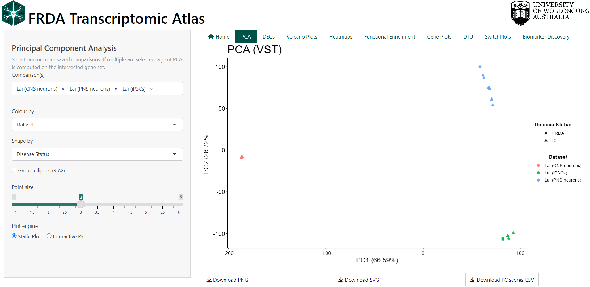{width="700"}

### Technical Details

PCA is performed on variance-stabilized gene expression matrices derived from DESeq2. When a single dataset is selected, all genes from that dataset are used directly. When multiple datasets are selected, analysis is restricted to genes shared across all datasets. If all selected datasets originate from the same parent study, PCA is computed on the variance-stabilized values. When datasets originate from different studies, gene-wise Z-score scaling is applied within each dataset prior to merging to reduce study-specific scale effects. Sample identifiers are made globally unique and expression matrices are strictly aligned with sample metadata. PCA is computed using singular value decomposition on the transposed expression matrix (samples × genes), with centering enabled and no additional scaling. The first two principal components are visualised, with optional 95% confidence ellipses to summarise group dispersion.

## Differentially Expressed Genes (DEGs)

Differential expression analysis identifies genes or isoforms (transcripts) whose expression levels differ between experimental conditions within a dataset. In this case all comparisons are between FRDA and the controls as defined by the original study. 

Each row in the DEG table represents a single gene or isoform and summarises both the magnitude of expression change (log₂ fold change) and the statistical confidence in that change (adjusted p-value, FDR).

Users can explore DEG results by:

- Switching between gene-level and isoform-level analyses
- Selecting a specific dataset
- Applying adjusted p-value thresholds
- Requiring a minimum absolute log₂ fold change
- Restricting results to upregulated, downregulated, or all genes/isoforms

Filtered tables can be explored interactively and downloaded for further analysis.

**Key**

- If the log₂ fold change is **positive**, this means that gene is expressed **higher in the FRDA group** compared to controls
- If the log₂ fold change is **negative**, this means that gene is expressed **lower in the FRDA group** compared to controls

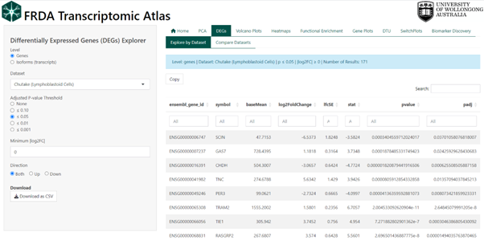{width="700"}

### Technical Details

DEGs were computed using DESeq2 in R. See original publication for more details.

## Venn Diagrams of Shared DEGs / DETs

Venn diagrams are used to compare overlap and uniqueness of differentially expressed genes (DEGs) or differentially expressed transcripts (DETs) across multiple datasets. This feature helps identify genes or isoforms that are consistently altered in FRDA across studies, as well as those that appear dataset-specific.

Each dataset contributes a set of filtered DEGs/DETs, and overlaps represent features that meet the same statistical and effect-size criteria in more than one dataset.

Users can control which features are included in the comparison by:

- Switching between gene-level and isoform-level analyses
- Selecting any number of datasets
- Applying adjusted p-value thresholds
- Requiring a minimum absolute log₂ fold change
- Restricting results to upregulated, downregulated, or all features

For clarity and accuracy, Venn diagrams are displayed when up to six datasets are selected. When more than six datasets are chosen, overlap is summarised in tables instead. The overlapping differentially expressed genes and isoforms are given in tables below the Venn diagram for download.

See section Biomarker Discovery for an alternate view of overlapping genes.

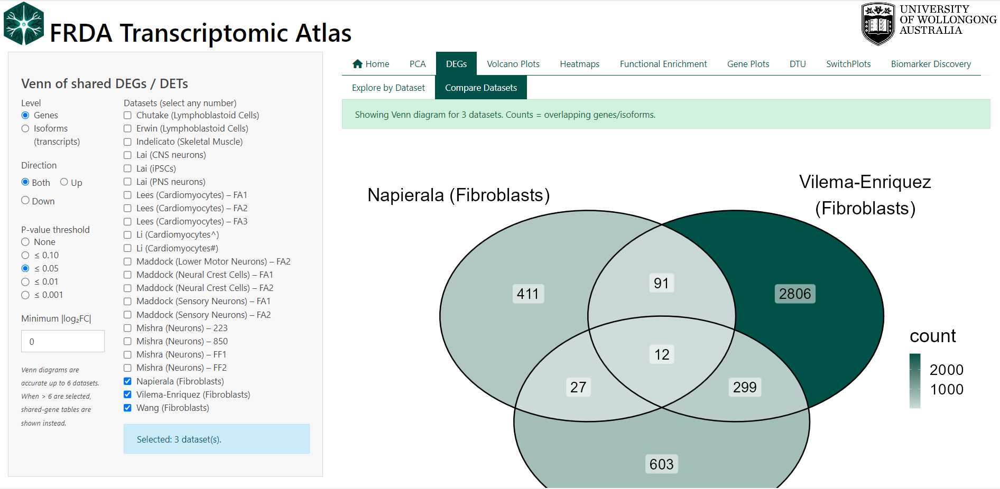{width="700"}

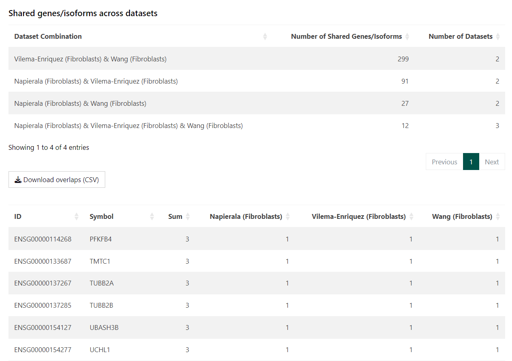{width="700"}

## Volcano Plots

Volcano plots provide a concise visual summary of differential expression results by displaying both the magnitude of change and the statistical significance for each gene or isoform within a dataset.

Each point represents a single gene or isoform. The x-axis shows the log₂ fold change between FRDA and control samples, while the y-axis shows statistical significance as −log₁₀(adjusted p-value). Genes with large expression changes and strong statistical support appear further from the centre and higher on the plot.

This view is intended to support rapid interpretation and prioritisation of results. Volcano plots can be used to:

- Identify strongly upregulated or downregulated genes in FRDA
- Assess the overall distribution of differential expression within a dataset
- Highlight genes of particular interest
- Compare gene-level versus isoform-level differential expression

Users can interactively customise the plot by:

- Switching between gene-level and isoform-level results
- Adjusting log₂ fold change and adjusted p-value thresholds
- Showing or hiding non-significant points
- Highlighting specific genes by name
- Selecting points directly on the plot using box or lasso tools

Selected genes appear in a table below the plot and can be inspected or exported.

Key

- Points to the right indicate higher expression in FRDA vs controls
- Points to the left indicate lower expression in FRDA vs controls
- Points above the significance threshold represent statistically significant changes

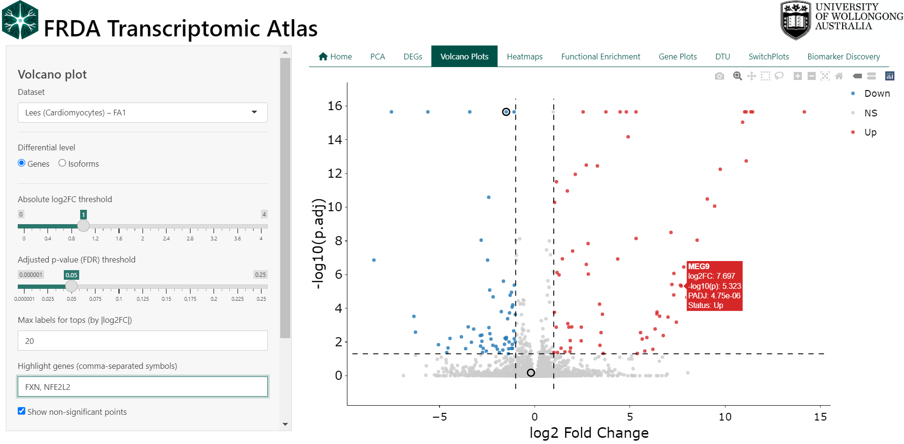{width="700"}

## Heatmaps

Expression heatmaps provide a visual overview of gene or isoform expression patterns across samples and datasets. Each row represents a gene or transcript, and each column represents an individual sample. Colours reflect relative expression levels, allowing patterns of similarity and difference to be assessed at a glance.

This feature is intended for exploratory analysis and comparison of expression patterns rather than statistical testing. Heatmaps can be used to:

- Compare expression patterns between FRDA and control samples
- Visualise expression of selected genes across samples
- Assess consistency of expression trends across datasets
- Identify groups of samples or genes with similar expression profiles

Users can customise the heatmap by:

- Switching between gene-level and isoform-level expression
- Selecting one or multiple datasets
- Entering a custom list of genes or transcripts
- Filtering samples by group (FRDA, control, or both)
- Enabling or disabling clustering of rows and columns. When clustering is disabled, samples can be ordered by dataset or by disease status to aid interpretation.

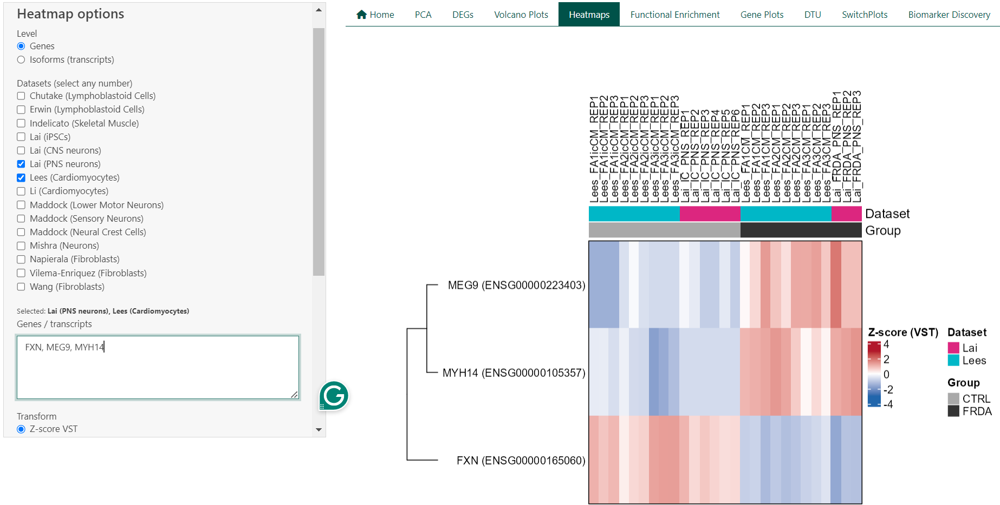{width="700"}

### Technical Details

For a single dataset, heatmaps are generated from transcript per million (TPM) values using either log₂(TPM + 1) transformation or row-wise Z-score scaling. When multiple datasets are selected, expression values are derived from DESeq2 variance-stabilised counts (VST) and scaled within each dataset using row-wise Z-scores prior to merging. This approach reduces dataset-specific scale effects and enables cross-dataset comparison. Heatmaps are rendered using the ComplexHeatmap framework, with annotations indicating dataset and disease status. Clustering is performed using hierarchical clustering.

## Functional Enrichment Analysis (GSEA)

Functional enrichment analysis is used to identify biological processes and pathways that are consistently associated with differential gene expression in FRDA. Rather than focusing on individual genes, this approach tests whether groups of functionally related genes show coordinated changes between FRDA and control samples.

In the FRDA Transcriptomic Atlas, enrichment analysis is performed separately for each dataset using Gene Set Enrichment Analysis (GSEA). Results are presented for Gene Ontology (GO) categories, including:

- Biological Process (BP)
- Molecular Function (MF)
- Cellular Component (CC)

This view is intended to support biological interpretation and hypothesis generation. GSEA can be used to:

- Identify biological processes altered in FRDA
- Compare functional signatures across datasets (see next section)
- Prioritise pathways supported by coordinated gene-level changes
- Explore consistency of pathway-level effects across studies (see next section)

Results are visualised using dot plots and tables, and users can inspect or download the genes contributing to each enriched term.

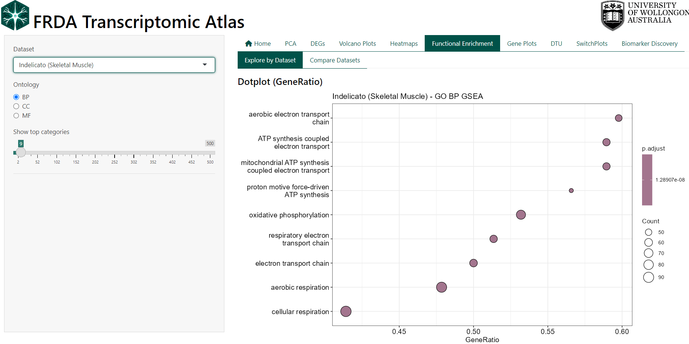{width="700"}

**Interpreting the Plots**

- GeneRatio reflects the proportion of genes in a pathway contributing to the enrichment signal.
- NES (Normalised Enrichment Score) indicates the direction and strength of enrichment, with positive values reflecting enrichment in FRDA and negative values reflecting enrichment in controls.
- Adjusted p-values (FDR) indicate statistical significance after correction for multiple testing.

### Technical Details

GSEA is performed using the clusterProfiler framework on ranked gene lists derived from DESeq2 results (run pre dataset). Genes are ranked by test statistic, and enrichment is assessed using a permutation-based approach. Enrichment results are reported for GO BP, MF, and CC ontologies, with leading-edge (core enrichment) genes available for inspection and download in a table below the graphs.

## Comparative Pathway Analysis:

This feature compares functional enrichment results across multiple datasets to identify biological pathways that are shared or unique between studies. Rather than comparing individual genes, it focuses on overlap at the pathway level, highlighting consistent functional signatures of FRDA across datasets.

Each dataset contributes a set of significantly enriched Gene Ontology (GO) terms derived from GSEA. Overlaps represent pathways that are enriched in more than one dataset under the same statistical criteria. This view is intended to support cross-study synthesis and reproducibility assessment. Pathway comparison can be used to:

- Identify biological processes consistently enriched across datasets
- Distinguish shared versus dataset-specific functional signatures
- Compare enrichment direction (upregulated vs downregulated pathways)
- Prioritise pathways supported by multiple independent studies

Users can customise the comparison by:

- Selecting any number of datasets
- Restricting analysis to upregulated, downregulated, or all enriched pathways
- Viewing overlap as a Venn diagram (≤ 6 datasets) or as summary tables (> 6 datasets)

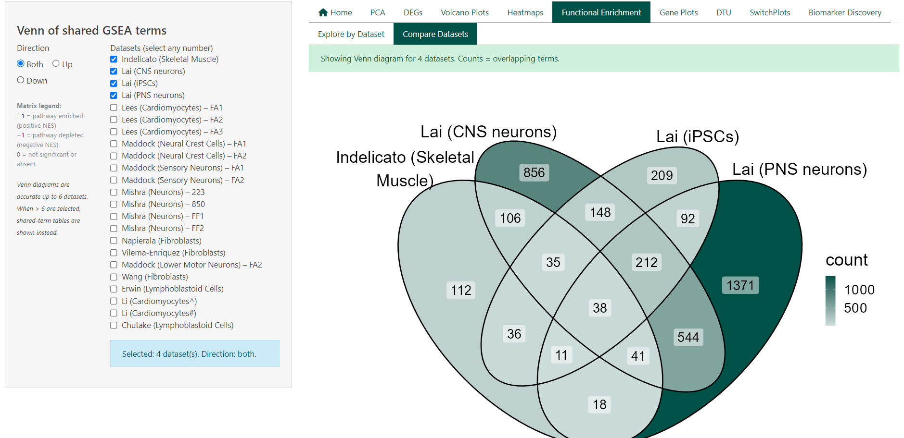{width="700"}

**Interpreting the Tables**

- Total terms per dataset report the number of significantly enriched pathways after filtering
- Shared terms summarise how many pathways are common to different dataset combinations
- Term lists show the presence and direction of enrichment for each pathway across datasets
- Pathway direction is encoded consistently across views:
    - +1 indicates significant enrichment (positive NES)
    - −1 indicates significant depletion (negative NES)
    - 0 indicates not significant or not detected

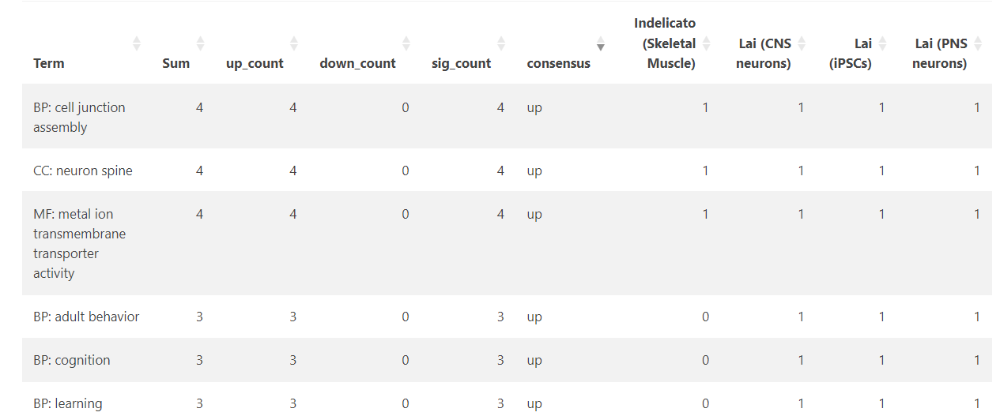{width="700"}

### Technical Details

Pathway overlap is computed from precomputed GSEA results using Gene Ontology (BP, MF, CC) terms from the previous section. For each dataset, terms are classified by enrichment direction based on the sign of the Normalised Enrichment Score (NES) and filtered by adjusted p-value. Overlaps are defined as pathways meeting significance criteria in two or more datasets under the selected direction filter. 

## Gene Expression Plots

This feature allows users to visualise your favorite gene as a dot plot within a selected dataset.

Expression values are shown as Transcripts Per Million (TPM).

Users can:

- Select a gene by symbol (e.g. FXN)
- Choose one or more datasets from the same study
- Compare FRDA and control groups for the selected gene
- Export plots and underlying data for reporting or downstream analysis

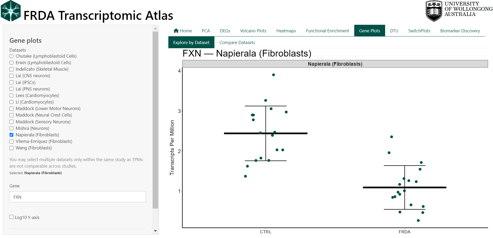{width="700"}

### Technical Details

Gene expression values are loaded from precomputed TPM matrices that come from the analysis pipeline (see original publication for methods). TPM values are not directly comparable across independent studies due to differences in library preparation, sequencing depth, and processing pipelines. For this reason, multiple datasets may only be selected within the same dataset family (e.g. only Lai datasets or only Maddock datasets). If datasets from different families are selected, the interface automatically restricts the selection and displays a warning. This ensures that all comparisons shown are biologically and technically valid. The plot is intended for descriptive exploration, not formal statistical testing.

## Forest Plot (Meta-analysis)

Forest plots are used to summarise gene-level differential expression across multiple independent studies. Each plot combines effect size estimates for a single gene to provide an overall assessment of expression change in FRDA relative to controls.

Each row in the plot represents an individual study, displayed as a square centred on the study-specific log₂ fold change. The size of the square reflects the relative weight of the study in the meta-analysis, and horizontal lines indicate the corresponding 95% confidence interval. The diamond at the bottom represents the pooled summary estimate from a random-effects model, with its width indicating the 95% confidence interval of the combined effect.

Forest plots can be used to:

- Assess whether a gene shows consistent differential expression across studies
- Compare the magnitude and direction of effects between datasets
- Identify studies that deviate from the overall trend
- Quantify between-study heterogeneity

Effect sizes greater than zero indicate higher expression in FRDA relative to controls, while negative values indicate lower expression in FRDA relative to controls.

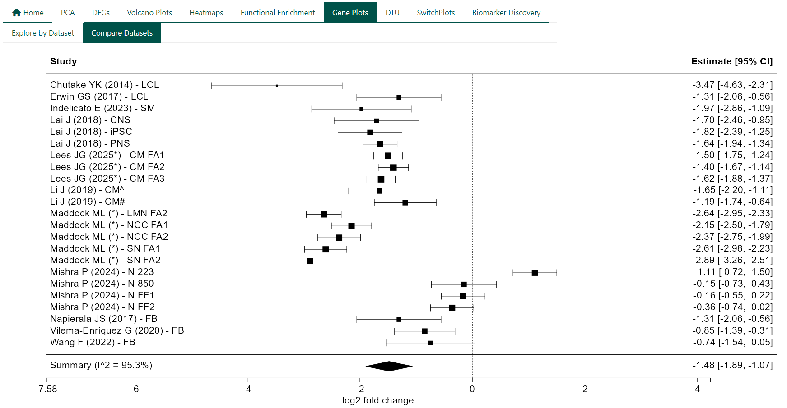{width="700"}

### Technical Details

For each gene, study-specific log₂ fold changes and their standard errors are extracted from DESeq2 results. Meta-analysis is performed using random-effects models. Between-study heterogeneity is assessed using I². Forest plots are generated using standard meta-analysis visualisation conventions, with a reference line at zero to indicate no differential expression.
