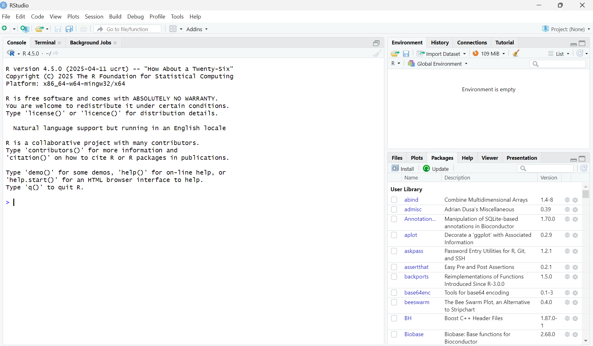
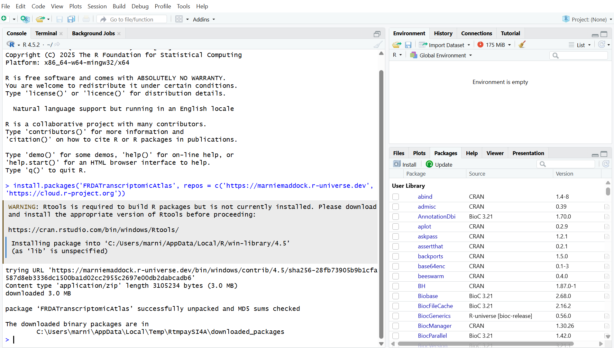

## For New R Users:

1.  Download R and RStudio (Free).

    <https://rstudio-education.github.io/hopr/starting.html>

2.  Open RStudio. It will look like this:

<details><summary>Click to Expand</summary>
{width="800"}
</details>

3.  Within the Console, copy and paste these pieces of code, then press **Enter**. The console is the panel on the left and starts with >

```r         
install.packages('FRDATranscriptomicAtlas', repos = c('https://marniemaddock.r-universe.dev', 'https://cloud.r-project.org'))
```

Once the installation has completed, a \> will appear in the console. It will say something similar to 'the downloaded binary packages are in ...\`. You may recieve a warning saying that Rtools is required to build packages. This is not an issue and can be ignored.


<details><summary>Click to Expand</summary>
{width="800"}
</details>

FRDA Transcriptomic Atlas has been downloaded, but it has not been loaded into the R session. To do this, type this line of code in the Console and press control/command enter to run it:


```r
library(FRDATranscriptomicAtlas)
```

This itself will not open the application. To open the application, run:

```r
run_app()
```

This should open the FRDA Transcriptomic Atlas app in a new window. If not, the http address given in your console following “Listening on” can be copied into a web browser to open FRDA Transcriptomic Atlas.

<details><summary>Click to Expand</summary>
{width="700"}
</details>

## Once Installed:

Once the FRDA Transcriptomic Atlas app has been installed on the computer, they do not need to be redownloaded unless there are updates i.e. you do **not** need to run `install.packages('FRDATranscriptomicAtlas', repos = c('https://marniemaddock.r-universe.dev', 'https://cloud.r-project.org'))` again. 

To run FRDA Transcriptomic Atlas in a new R session use (i.e. if you close R an dopen it again):

```r
library(FRDATranscriptomicAtlas)
run_app()
```

The app will open in a new window. In the top corner you can click

## For Existing R Users:

1.	Open RStudio and Run:


```r
install.packages('FRDATranscriptomicAtlas', repos = c('https://marniemaddock.r-universe.dev', 'https://cloud.r-project.org'))
library(FRDATranscriptomicAtlas)
run_app()
```

 
2.	FRDA Transcriptomic Atlas will open in a new window.

[How to Use FRDA Transcriptomic Atlas »](how_to_use.qmd){.btn .btn-md style="background:#2a776d;border-color:#2a776d;color:#fff;"}
